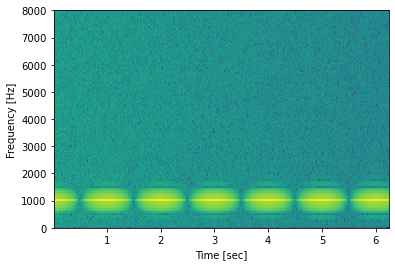
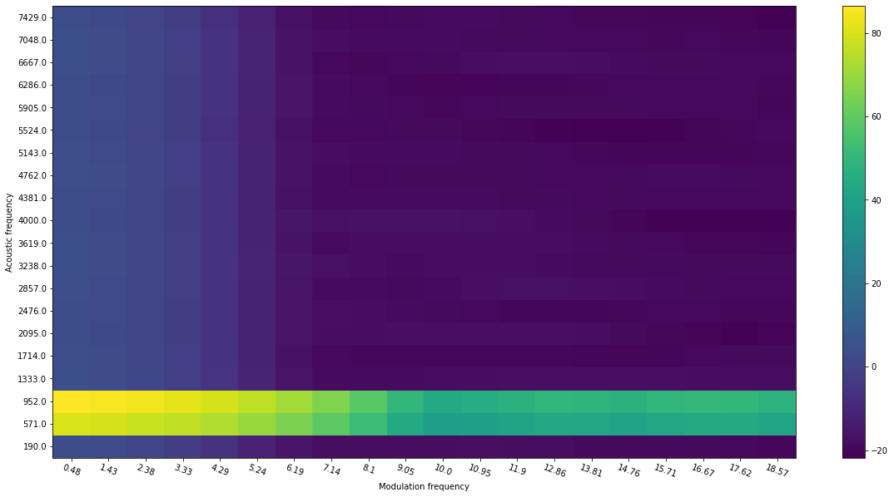
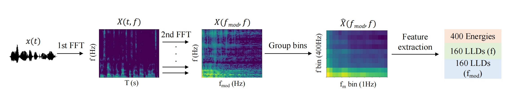

# Quantized modulation spectrogram

The script covers the following functionalities:
1) compute spectrogram energies (original and log) using customized filterbanks
2) compute modulation spectrogram energies (original and log) using customized filterbanks
3) compute quantized modulation spectrogram features

It also provides short demos for each step of the computation, from the original spectrogram to filtered spectrogram, and filtered modulation spectrogram.  

# Set-up
Simply run
`python setup.py` install from inside the `modulation_filterbanks` folder to install this package.

# Usage
`To be filled`

# Background
Spectrograms have been widely used as the time-frequency representation of a speech signal. However, environment noise can overlap in both time and frequency, thus making spectrograms sub-optimal. The modulation spectrogram, in turn, captures the rate-of-change of frequency components thus becomes favored for in-the-wild speech analysis.

# Demos of modulation spectrogram vs spectorgram
## Demo1: High SNR setting 
- Spectrogram of a modulated signal (modulated by fm = 1Hz): 
 
- Quantized (20\*20) version of modulation spectrogram (using linear filterbank): 
*Notice the higher energy at fm = 1Hz 
 

## Demo2: Low SNR setting 
- Spectrogram of a modulated signal (modulated by fm = 8Hz): 
 
- Quantized version of modulation spectrogram (using linear filterbank): 
*Notice the higher energy at fm = 8Hz 
 

## Demo3: COVID vs Non-COVID 
Quantized modulation spectrogram can be used to characterize subtle hidden changes to the speech signal caused by COVID. Below are averaged modulation spectrograms for (a) COVID and (b) non-COVID speech (values min-max scaled).
 

# Feature extraction pipeline
We firstly compute the quantized modulation spectrogram, then extract eight different descriptors from each frequency and modulation frequency bin. Steps are depiected in the following graph. 
 

# Related articles
- Y. Zhu and T. H. Falk, "Fusion of Modulation Spectral and Spectral Features with Symptom Metadata for Improved Speech-Based Covid-19 Detection," ICASSP 2022 - 2022 IEEE International Conference on Acoustics, Speech and Signal Processing (ICASSP), 2022, pp. 8997-9001, doi: 10.1109/ICASSP43922.2022.9746471.

# Related resources
Part of the script is modified from 'python_speech_features' module and 'modulation spectrogram' module. Links are provided below:
- https://github.com/jameslyons/python_speech_features
- https://github.com/MuSAELab/amplitude-modulation-analysis-module
