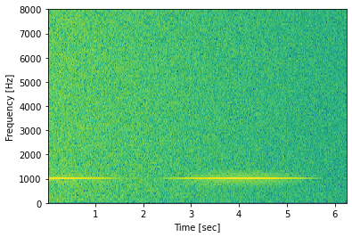
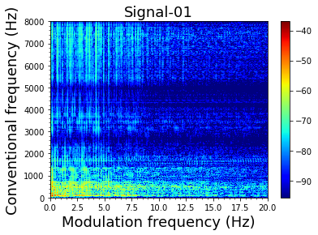
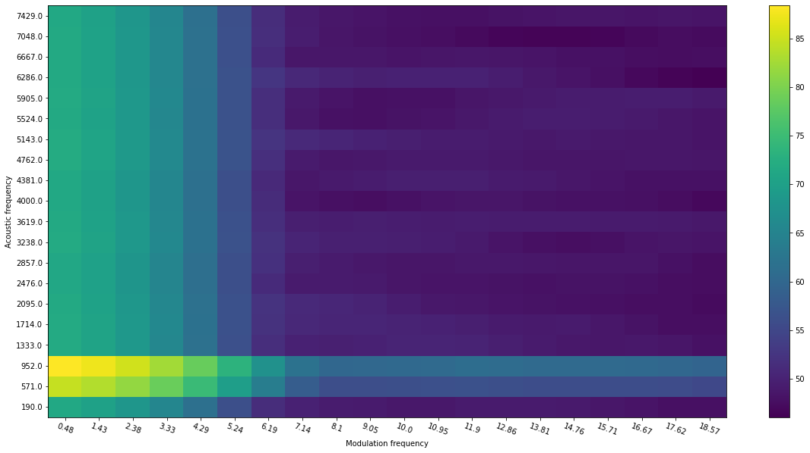
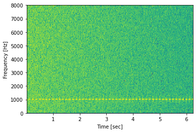
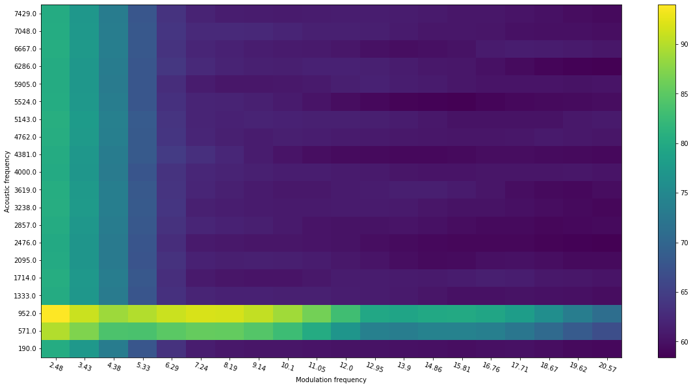

# Quantized spectrogram/modulation spectrogram

The script covers the following functionalities:
1) compute spectrogram energies (original and log) using customized filterbanks
2) compute modulation spectrogram energies (original and log) using customized filterbanks
3) compute quantized modulation spectrogram features

It also provides short demos for each step of the computation, from the original spectrogram to filtered spectrogram, and filtered modulation spectrogram.  

# Demo1: 
- Spectrogram of a modulated signal (modulated by f_m = 0.25Hz): 
 
- Modulation spectrogram of the signal (averaged over time): 
 
- Quantized (20\*20) version of modulation spectrogram (using linear filterbank): 
*Notice the higher energy at f_m < 1Hz
 

# Demo2: High SNR setting 
- Spectrogram of a modulated signal (modulated by f_m = 8Hz): 
 
- Quantized version of modulation spectrogram (using linear filterbank): 
*Notice the higher energy at f_m = 8Hz
 
