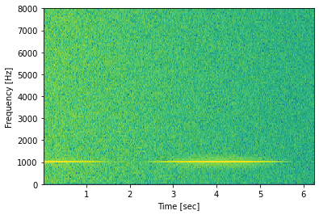
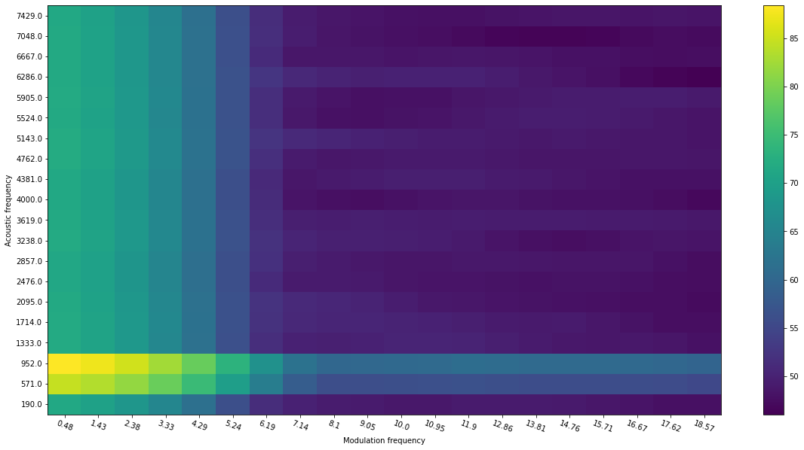

# Quantized spectrogram/modulation spectrogram

The script covers the following functionalities:
1) compute spectrogram energies (original and log) using customized filterbanks
2) compute modulation spectrogram energies (original and log) using customized filterbanks
3) compute quantized modulation spectrogram features

It also provides short demos for each step of the computation, from the original spectrogram to filtered spectrogram, and filtered modulation spectrogram.  

Demos: 
1.Original spectrogram of a modulated signal: 

2.Original modulation spectrogram of the signal: 

3.Quantized (20\*20) version of modulation spectrogram (with linear filterbank): 

