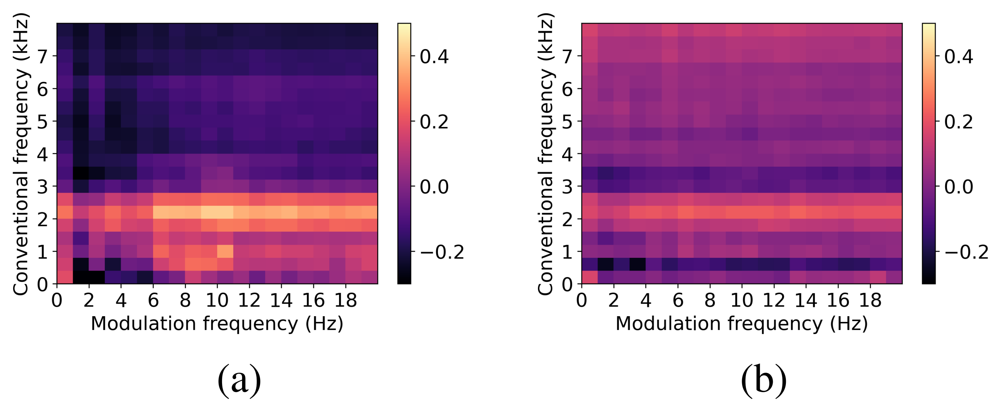

# Modbank: a filterbank version of modulation spectrogram with low-level descriptors

The script covers the following functionalities:
1) compute spectrogram energies (original and log) using customized filterbanks
2) compute modulation spectrogram energies (original and log) using customized filterbanks
3) compute quantized modulation spectrogram features

It also provides short demos for each step of the computation, from the original spectrogram to filtered spectrogram, and filtered modulation spectrogram. <br />

# Set-up
Simply run
`python setup.py install` from inside the `modulation_filterbanks` folder to install this package.


# Usage
1.Extract a time sequence of modulation spectrogram energies + features.  <br />
Output shape `[Num_timeframe, Num_features]`
```
from modbank import fbank

msf  = fbank.msf_all(x, fs, win_size1:float=.032, win_shift1:float=.008, win_size2:float=.256, win_shift2:float=.064,
                     n_fft_factor1:int=1, n_fft_factor2:int=1, n_freq_filters=20, n_mod_filters=20,
                     low_freq=0, high_freq=None, min_cf=0, max_cf=20, ftype1:str='linear',ftype2:str='linear')
```
2.Compute just filterbanked modulation spectrogram (without log) <br />
Output shape `[Num_timeframe, Num_frequency_bins, Num_modulation_bins]`
```
mod_spec = msr_filtered(x, fs, win_size1:float=.032, win_shift1:float=.008, 
                        win_size2:float=.256, win_shift2:float=.064,
                        n_fft_factor1:int=1, n_fft_factor2:int=1,
                        n_freq_filters=20, n_mod_filters=20,
                        low_freq=0, high_freq=None, min_cf=0, max_cf=20,
                        ftype1:str='linear',ftype2:str='linear')
```
for log version, use:
```
mod_spec_log = msr_filtered_log(x,fs)
```
3.Filterbanks can be obtained alone, for example: (use 'plt.pcolormesh' can help to visualize.)
```
filter_mod = get_filterbanks(nfilt=20,nfft=512,samplerate=125,lowfreq=0,highfreq=20)
```

Some explanation of parameters:
```
win_size1:      window size for 1st FFT (default 32ms)
win_size2:      window size for 2nd FFT (default 256ms)
win_shift1:     window shift (step) for 1st FFT (default 8ms)
win_shift2:     window shift (step) for 2nd FFT (default 64ms)
n_fft_factor1:  multiplication factor to number of 1st FFT points (default 1)
n_fft_factor2:  multiplication factor to number of 2nd FFT points (default 1)
n_freq_filters: number of acoustic (conventional) frequency filters (default 20)
n_mod_filters:  number of modulation frequency filters (default 20)
low_freq:       lower bound of acoustic frequency (default 0)
high_freq:      higher bound of acoustic frequency (default None)
min_cf:         lower bound of modulation frequency (default 0)
max_cf:         higher bound of modulation frequency (default 20Hz)
ftype1:         filterbank type for 1st FFT (default 'linear')
ftype2:         filterbank type for 2nd FFT (default 'linear')
```
Notice that parameters are set to default as optimal values found for speech processing. For more description, please refer to the related paper (scroll down to this page :))

# Background
Spectrograms have been widely used as the time-frequency representation of a speech signal. However, environment noise can overlap in both time and frequency, thus making spectrograms sub-optimal. The modulation spectrogram, in turn, captures the rate-of-change of frequency components thus becomes favored for in-the-wild speech analysis.

# Demos of quantized modulation spectrograms
## Demo1: High SNR setting<br />
- Spectrogram of a modulated signal (modulated by f<sub>m</sub> = 1Hz):<br />
<br />
- Quantized (20\*20) version of modulation spectrogram (using linear filterbank):<br />
*Notice the higher energy at f<sub>m</sub> = 1Hz<br />
<br />


## Demo2: Low SNR setting<br />
- Spectrogram of a modulated signal (modulated by f<sub>m</sub> = 8Hz):<br />
<br />
- Quantized version of modulation spectrogram (using linear filterbank):<br />
*Notice the higher energy at f<sub>m</sub> = 8Hz<br />
<br />

## Real-world demo: COVID vs Non-COVID<br />
Quantized modulation spectrogram can be used to characterize subtle hidden changes to the speech signal caused by COVID. Below are averaged modulation spectrograms for (a) COVID and (b) non-COVID speech (values min-max scaled).
<br />

# Feature extraction pipeline
We firstly compute the quantized modulation spectrogram, then extract eight different descriptors from each frequency and modulation frequency bin. Steps are depiected in the following graph.<br />
<br />

# Related articles
- Y. Zhu and T. H. Falk, "Fusion of Modulation Spectral and Spectral Features with Symptom Metadata for Improved Speech-Based Covid-19 Detection," ICASSP 2022 - 2022 IEEE International Conference on Acoustics, Speech and Signal Processing (ICASSP), 2022, pp. 8997-9001, doi: 10.1109/ICASSP43922.2022.9746471.

# Related resources
Part of the script is modified from 'python_speech_features' module and 'modulation spectrogram' module. Links are provided below:
- https://github.com/jameslyons/python_speech_features
- https://github.com/MuSAELab/amplitude-modulation-analysis-module
